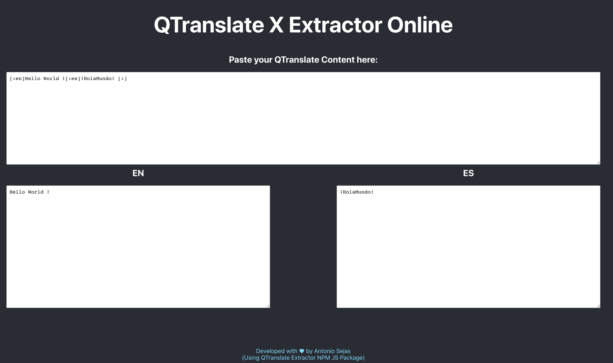

# qtranslatex-extractor-js

Library in tpyescript to help you to move a QtranslateX Wordpress Site into a WPML.
If your site is stucked in QtranslateX, then this is your solution to move your content.

NPM Packate: [https://www.npmjs.com/package/qtranslatex-extractor](https://www.npmjs.com/package/qtranslatex-extractor)

## Demo

- You can try it live in: [https://sejas.github.io/qtranslatex-online/](https://sejas.github.io/qtranslatex-online/)
- The demo code is in this repo: [https://github.com/sejas/qtranslatex-online](https://github.com/sejas/qtranslatex-online)



## How it works?:

Receive the qtranslate string and return an object with each translation.
Use it with NodeJS to automate your process.
Or in your frontend to show your text dinamically.

```ts
import qtranslatexExtractor from 'qtranslatex-extractor'

const translations = qtranslatexExtractor('[:en]Hello World ![:es]¡HolaMundo![:]')
```

## Author

© Antonio Sejas
Feb 2019
MIT License
